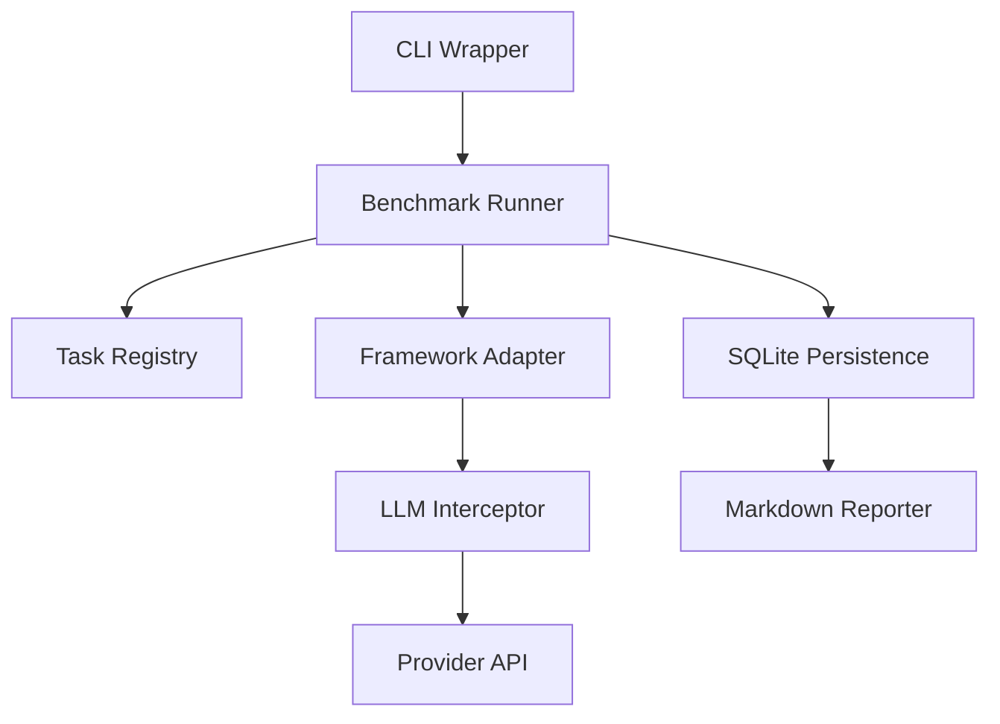

# `langgraph-vs-crewai` ⚖️ 
### The Open-Source Standard for Agentic Framework Benchmarking

> "No opinions. No marketing. Just numbers." — Principal Engineer’s Manifesto

---

## 🔬 Project Overview
`langgraph-vs-crewai` is a production-grade, community-driven benchmark suite designed to objectively compare AI Agent frameworks (LangGraph, CrewAI, AutoGen, etc.) using rigorous scientific method. 

Unlike traditional "vibes-based" comparisons, this project uses **Welch's T-Tests**, **Cohen's D Effect Size**, and **Multi-Agent Simulation** to provide data that survives peer review.

### Key Pillars:
1.  **Impartial Interception**: A custom Proxy layer captures raw API transactions, ensuring 100% token fairness and bypassing framework-reported bias.
2.  **Scientific Rigor**: Significance masking (P-value < 0.05) ensures conclusions are driven by data, not noise.
3.  **Cost Economics**: Versioned pricing models correlate token usage with real-world USD costs.
4.  **Operational Isolation**: Dockerized execution environments prevent "polluted" benchmarks caused by framework global state leaks.

---

## 📊 The Task Registry (20 Total)
We measure frameworks across three distinct tiers:

*   **🟢 Tier 1 (Simple - 7/7)**: Tool Call, JSON Extraction, Multi-Tool selection, Context Recall, Reasoning Logic.
*   **🟡 Tier 2 (Moderate - 7/7)**: Multi-Step Research (Sequential), Long Context (50k+ tokens), Tool Use with Files.
*   **🔴 Tier 3 (Complex - 6/6)**: Cascading Failures, Multi-Agent Debate, Multi-Day Scheduling, Human-in-the-loop.

---

## 🛠️ Quick Start

### Installation
```bash
git clone https://github.com/Ismail-2001/langgraph-vs-crewai.git
cd langgraph-vs-crewai
pip install -r requirements.txt
```

### Run a Benchmark
```bash
# Run 10 iterations of all Tier 1 tasks
python -m benchmark.cli run --n 10 --tasks tier-1 --output results/initial_launch
```

### Review the Report
Once complete, check `results/[output]/report.md` for a comprehensive statistical comparison.

---

## 📐 Architecture


---

## 🛡️ Methodology
- **Statistical Significance**: We use Welch’s t-test to account for unequal variances between frameworks.
- **Fairness**: Every LLM call is intercepted at the network level via monkeypatching to ensure no framework "hopes" or "retries" are hidden from the final count.
- **Reproducibility**: All raw traces are saved as JSON with unique UUIDs and high-fidelity timestamps.

---

## 🤝 Contributing
Contributions that improve the scientific validity or task coverage are welcome. Please ensure all new tasks include a clear rubric and expected JSON schema.

---

## ⚖️ License
MIT License. Created by [Ismail Sajid](https://github.com/Ismail-2001).
